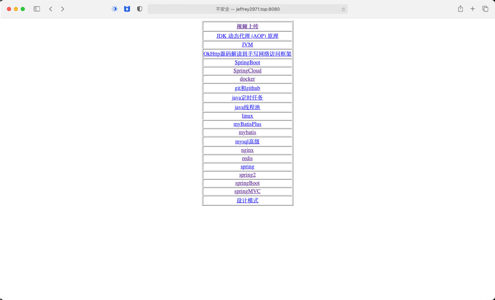
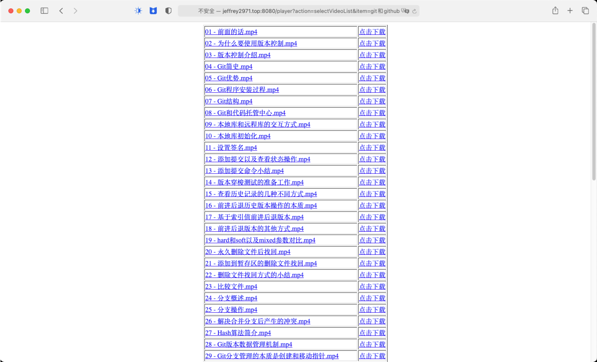
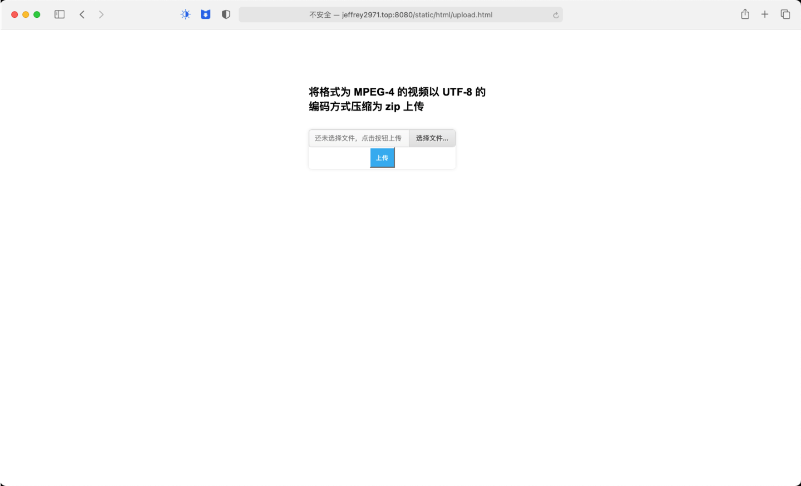

# 一个简单的播放平台

### ① 技术选型

- MySQL 5.7.35
- JDK 1.8
- muiplayer 前端播放器
- jquery 1.7.2

#### ② 功能介绍

- 可实现批量 MPEG-4 视频压缩上传，服务器会自动解压筛选后添加到播放列表，上传的视频可下载
- 在视频上传后服务器会对每一个视频采集缩略图，采集期间不影响视频观看。每个视频对应的缩略图列表会保存在数据库。实时监测视频列表，如视频发生修改、删除程序会自动删除对应缩略图以节省空间
- 视频播放时可设置网页全屏、全屏、音量控制、播放倍速等
- 对上传伪造压缩包的用户进行 ip 封禁

#### ③ 应用展示

- 
- 
- 
- 